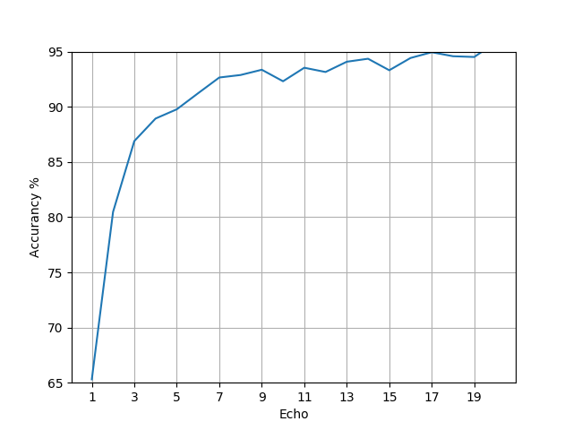

# Robotica-Proyecto-Final

Proyecto Final para el curso de robotica CSUNSA, robot carrito reconocedor de señales de transito usando CNN

### 1. El modelo utilizado consiste en las siguientes capas:

| Layer No. | Layer  		|     Description	        					| 
|:-:|:----------------:|:----------------------------:| 
|   | Input          		| 28x28x1 image 							| 
| 1 | Convolution 5x5 	| 1x1 stride, valid padding, outputs 24x24x8 	|
|   | RELU			        		|					Activation							|
|   | Max pooling	    	| 2x2 stride, outputs 12x12x8 				|
| 2 | Convolution 3x3  | 1x1 stride, valid padding, outputs 10x10x20 |
|   | RELU		           |      Activation   									|
|   | Max pooling			  	| 2x2 stride, outputs 5x5x20        				|
| 3 | Convolution 2x2  | 1x1 stride, valid padding, outputs 4x4x60 |
|   | RELU		           |      Activation   									|
|   | Max pooling			  	| 2x2 stride, outputs 2x2x60        									|
|	  | Flatten			     		|	outputs 240											|
| 4 |	Fully connected		|	outputs 160, dropout		|
|   | RELU             |      Activation       |
| 5 |	Fully connected		|	outputs 80											|
|   | RELU             |      Activation      |
|	6 | Fully connected		|	outputs 43											|
 

### 2. El grafico de entrenamiento

